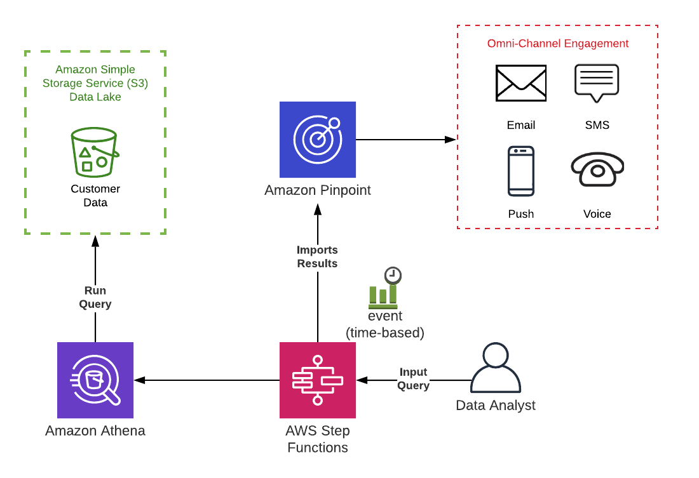
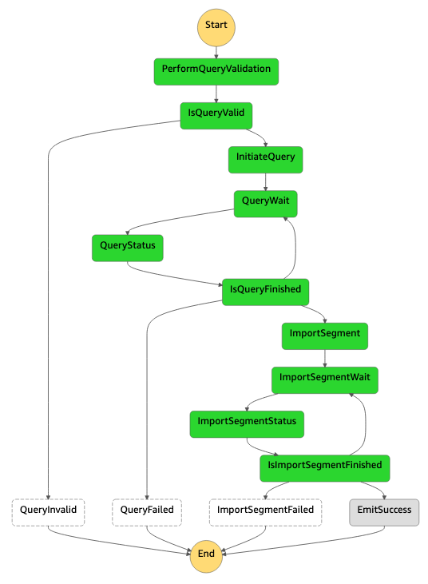
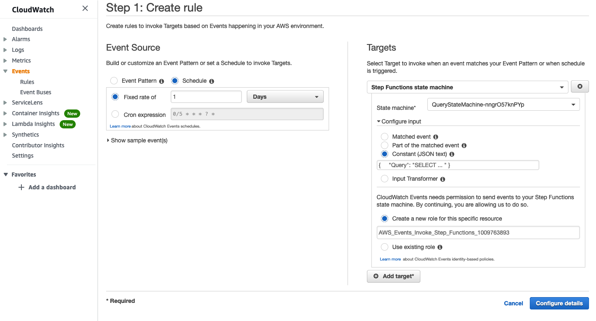

# Amazon Pinpoint Data Lake Powered Segmentation

Using this architecture, customers can create complex segmentation scenarios using their existing customer data lake investments to query data in place.  This architecture will create a reusable pattern to orchestrate validate and execute the segmentation queries and import the results directly into Amazon Pinpoint.

The solution uses several AWS resources, including AWS Lambda functions and an Amazon Step Function state machine.  These resources are defined in the [template.yaml](template.yaml) file in this repository.  



## Background on Solution

Amazon Pinpoint is a multi-channel digital engagement service.  It enables customers to send both promotional and transactional messages across email, SMS, push notifications, voice, and custom channels.  Amazon Pinpoint has built in capability to store end users, end users' addresses and attributes.  It then enables customers to perform basic segmentation on these attributes to create dynamic segments which customers can use for campaigns and journeys.  Using dynamic segments, customers can apply filters to their audiences by looking for users with matching attributes.

Attributes are defined by customers, but examples of attributes that customers might define to be used for filtering are:
* CustomerLifetimeValue - High/Med/Low
* LifecycleStage - Trial/Upsell/Renewal
* Usage - High/Med/Low

These would allow customers in Pinpoint to create dynamic segments like:  Everyone who is a `High` CustomerLifetimeValue and is in the `Renewal` LifecycleStage and has `Med` Usage of the product.

Customers need a way to get these attribute values into Pinpoint using complex logic and data that might exist in a Customer Data Lake.

## Solution

Using Amazon Athena, customers can query their customer data lakes to perform these complex logic queries.  Further, if customers format their queries properly, then the result of the query could be directly imported into Amazon Pinpoint.  This solution helps perform and automate this pattern so that data analysts can set up queries to be run automatically against a data lake to keep data in Amazon Pinpoint up-to-date.

Minimally, to import data into Amazon Pinpoint, the uploaded file needs to contain the Endpoint ID, or the unique identifier that is used to identify an address, and the attributes being updated.

Ex:
```
Id,Attributes.NumEmailsOpenedLast30Days,User.UserAttributes.CustomerLifetimeValue
123abc,43,High
```

Paired with the Digital User Engagement Events Database as data in the customer data lake, customers can run queries that combine engagement history.

The queries are then put into an Amazon Step Function State Machine to orchestrate the process of validation, execution, and import into Amazon Pinpoint.



An SNS Topic is created so that operations teams can track the status of each step function execution.

The step function can also be scheduled to be run on set intervals to ensure data in Amazon Pinpoint stays up-to-date by using Amazon CloudWatch event rules.


## Example Queries

Below are sample fictitious queries using fictitious data.  They are inspirational and not meant to be used literally.

#### Update all endpoints that have clicked on an email
```
SELECT DISTINCT(endpoint_id) as Id, 'Yes' as \"User.UserAttributes.HasClicked\"
FROM email_click
```

#### Update the LifecycleStage for customers who are 30 days from their subscription end date

```
SELECT MAX(contact.id) as Id, 'Renewal' as \"User.UserAttributes.LifecycleStage\"

FROM salesforce_contact contact

INNER JOIN salesforce_loan__c loan
   ON loan.contact_id = contact.id

LEFT JOIN some_other_data other
   ON contact.id = other.endpoint_id

WHERE loan.end_date > date_add('day', -30, NOW())
   AND loan.auto_renewal = false
   AND contact.missed_payments = 0

GROUP BY endpoint.id
```


#### Update all unengaged users by what state they live in defined by Google Analytics data
```
SELECT MAX(contact.id) as Id, MAX(contact.state) as \"User.UserAttributes.UnengagedByState\"

FROM salesforce_contact contact

LEFT JOIN email_click click
   ON contact.id = click.endpoint_id

LEFT JOIN system_logins logins
  ON logins.username = contact.username

LEFT JOIN google_analytics ga ON ga.user_id = contact.id

WHERE click.ingest_timestamp > date_add('month', -6, NOW())

   AND logins.timestamp > date_add('month', -6, NOW())
   AND ga.timestamp > date_add('month', -6, NOW())
GROUP BY endpoint.id
HAVING COUNT(click.event_timestamp) < 2
   AND COUNT(logins.timestamp) < 2 AND COUNT(ga.timestamp) < 2

```

#### Update all users who have created a session in the last 24 hours
```
SELECT DISTINCT(endpoint_id) as Id, 'Yes' as "Attributes.LoggedInDuringLast24Hours"
FROM session_start
WHERE ingest_timestamp > current_timestamp - interval '24' hour
```

## Deployment Steps

### Use CloudFormation

Using the [template.yaml](template.yaml) found in this repository, log into your AWS Account and navigate to Amazon CloudFormation and deploy the template.  You will need to provide the following information:

* **Stack Name**: The name of the stack to deploy to CloudFormation. This should be unique to your account and region, and a good starting point would be something matching your project name.
* **DataLakeS3Path**:  Full S3 URL path to your data lake.  Ex: s3://path/to/data
* **GlueCatalog**: AWS Glue Catalog for where the Data Lake database is registered
* **GlueDatabase**: AWS Glue Database that contains the Data Lake
* **PinpointProjectId**: The Amazon Pinpoint Project ID to import the results into
* **QueryResultsS3Path**: Full S3 URL path to a location where query results can be stored before being uploaded into Pinpoint.

After the CloudFormation stack completes deployment.  Navigate to the AWS Step Functions console, select the newly create StateMachine, and start a new Execution with the following input:
```
{
    "Query": "SELECT ..."
}
```

The step function can also be scheduled to be run on set intervals to ensure data in Amazon Pinpoint stays up-to-date by using Amazon CloudWatch event rules.


